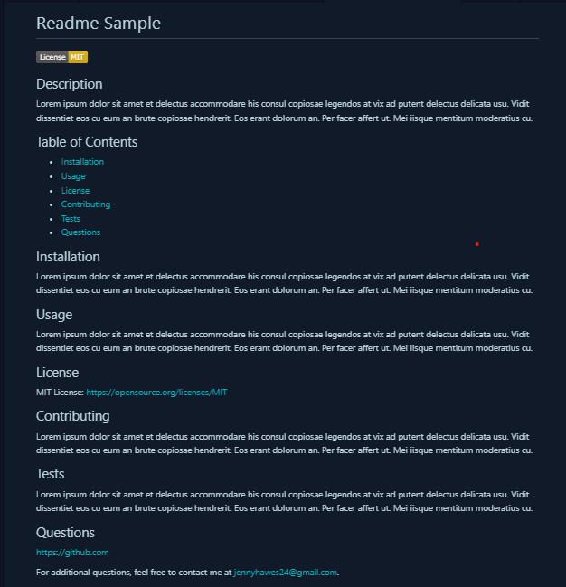

# Quick README Generator

## Description

A command-line application that quickly generates a high-quality, professional README.md file from a user's input using the [Inquirer package](https://www.npmjs.com/package/inquirer/v/8.2.4).

The README.md is generated with the title of the project and has sections entitled Description, Table of Contents, Installation, Usage, License, Contributing, Tests, and Questions. The information the user gives is added to the appropriate section and a badge for the license that was chosen is added below the title.

## Usage

This application is invoked by using the following command:
``` 
node index.js
```

## Visuals



## Walkthrough Video
Use the link below to view a walkthrough of this application.

https://drive.google.com/file/d/1LLnlExoiPkF3AMDY-gbSM8u8cNHbTpC-/view

If the video is blurry, download the video above or use this link: 
-   https://app.castify.com/view/f7f1c518-47ce-49ef-b5e7-338188acbdde

## Questions

Feel free to contact me at my jennyhawes24@gmail.com or look at my [Github](https://github.com/JenniferKiesler).
